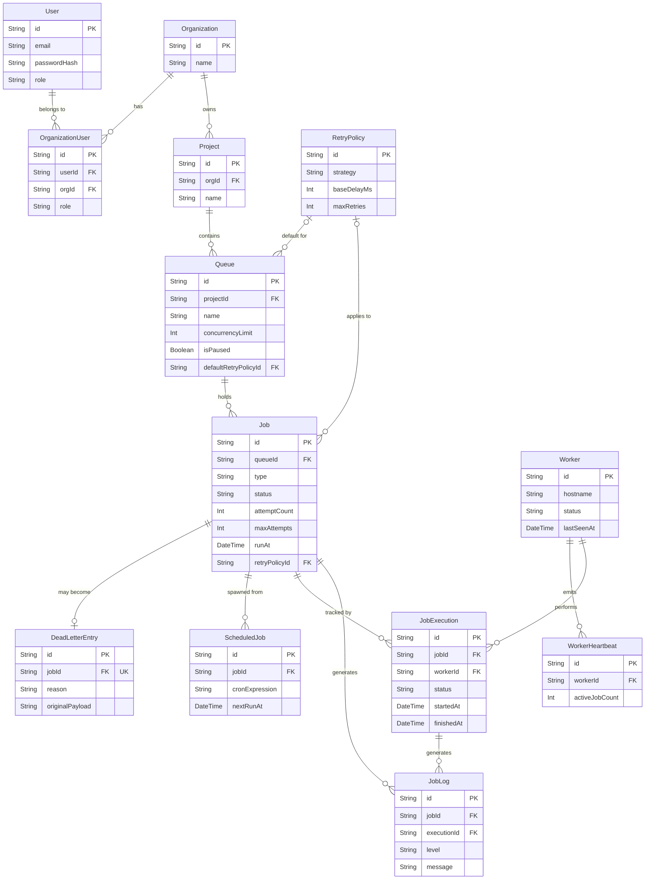

# Entity-Relationship Diagram

This diagram visualizes the data models defined in our Prisma schema and their relationships.

```mermaid
erDiagram
    %% Auth & Tenancy
    User ||--o{ OrganizationUser : "belongs to"
    Organization ||--o{ OrganizationUser : "has"
    Organization ||--o{ Project : "owns"

    %% Hierarchy
    Project ||--o{ Queue : "contains"
    
    %% Config
    RetryPolicy |o--o{ Queue : "default for"
    RetryPolicy |o--o{ Job : "applies to"

    %% Core
    Queue ||--o{ Job : "holds"
    Job ||--o| DeadLetterEntry : "may become"
    Job ||--o{ ScheduledJob : "spawned from"

    %% Execution & Workers
    Worker ||--o{ WorkerHeartbeat : "emits"
    Worker ||--o{ JobExecution : "performs"
    Job ||--o{ JobExecution : "tracked by"

    %% Auditing
    Job ||--o{ JobLog : "generates"
    JobExecution ||--o{ JobLog : "generates"

    User {
        String id PK
        String email
        String passwordHash
        String role
    }

    Organization {
        String id PK
        String name
    }

    OrganizationUser {
        String id PK
        String userId FK
        String orgId FK
        String role
    }

    Project {
        String id PK
        String orgId FK
        String name
    }

    Queue {
        String id PK
        String projectId FK
        String name
        Int concurrencyLimit
        Boolean isPaused
        String defaultRetryPolicyId FK
    }

    RetryPolicy {
        String id PK
        String strategy
        Int baseDelayMs
        Int maxRetries
    }

    Job {
        String id PK
        String queueId FK
        String type
        String status
        Int attemptCount
        Int maxAttempts
        DateTime runAt
        String retryPolicyId FK
    }

    Worker {
        String id PK
        String hostname
        String status
        DateTime lastSeenAt
    }

    JobExecution {
        String id PK
        String jobId FK
        String workerId FK
        String status
        DateTime startedAt
        DateTime finishedAt
    }

    WorkerHeartbeat {
        String id PK
        String workerId FK
        Int activeJobCount
    }

    JobLog {
        String id PK
        String jobId FK
        String executionId FK
        String level
        String message
    }

    ScheduledJob {
        String id PK
        String jobId FK
        String cronExpression
        DateTime nextRunAt
    }

    DeadLetterEntry {
        String id PK
        String jobId FK "UK"
        String reason
        String originalPayload
    }
```
